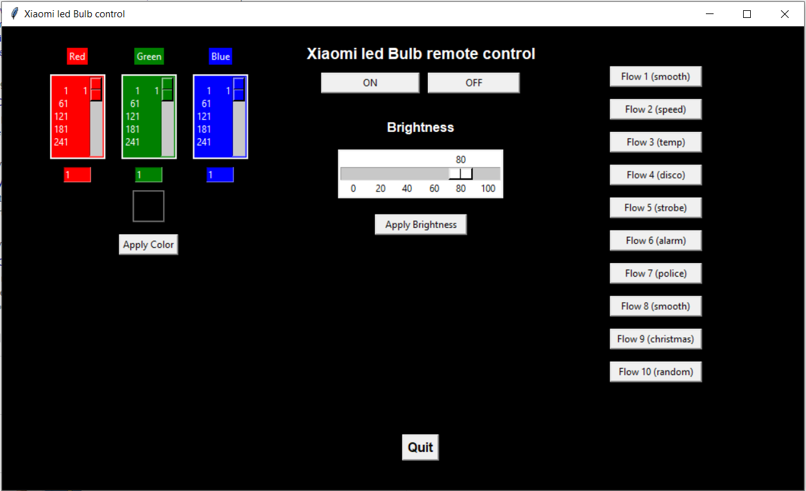
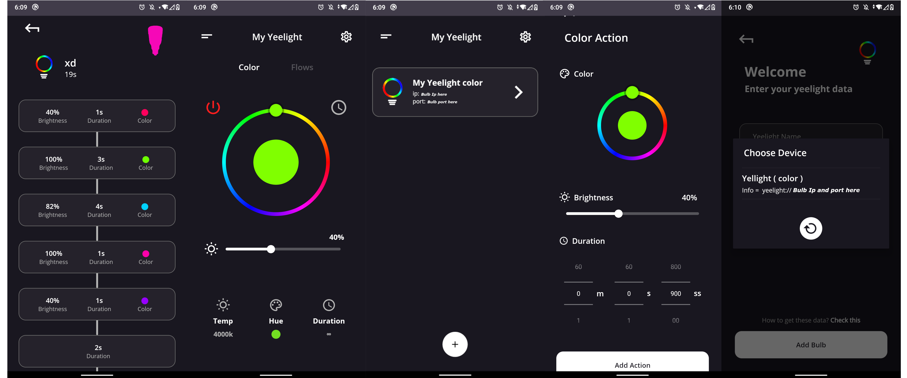

## My Two Own Apps To Control Xiaomi Yellight

#### Desktop Python Application and Android Kotlin application, which helps you control the yeelight bulb 💡

A Few resources to get when you start write your first project in python:
- [Tkinter Desktop UI Library Documentation](https://docs.python.org/3/library/tk.html)
- [Python Documentation](https://docs.python.org/3/)

 

A Few resources to get when you start write your first project in kotlin:
- [Kotlin Codelabs](https://developer.android.com/codelabs/kotlin-android-training-welcome#0)
- [Kotlin Documentation](https://kotlinlang.org/docs/reference/)

 

## Python Project :

### In that App you can set your own color and brightness, also you can apply the built in flow.
#### Used libraries:

- Tkinter Library [link](https://docs.python.org/3/library/tk.html) 
- Yeelight Library [link](https://yeelight.readthedocs.io/en/latest/)

## Kotlin Project :

